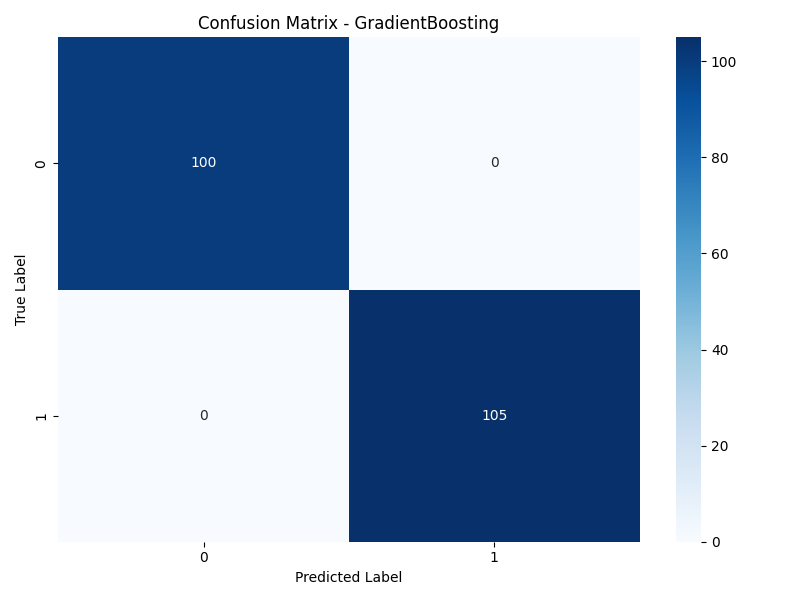
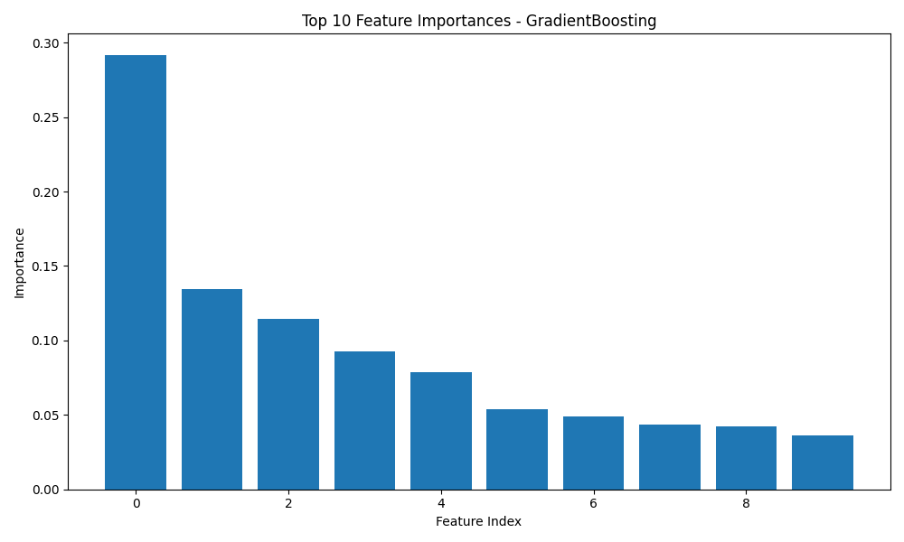
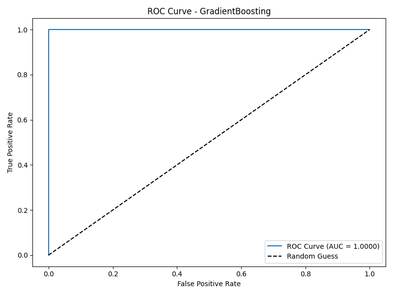

# Heart Disease Prediction — AutoML Pipeline

**Авторы: Сидоров Павел, Сидорова Екатерина


## Описание бизнес-задачи

Разработка автоматизированного ML-пайплайна для предсказания наличия сердечно-сосудистых заболеваний на основе медицинских показателей пациентов (датасет Heart Disease Dataset, Kaggle). 

**Цель:** автоматизировать подбор модели машинного обучения для помощи врачам в ранней диагностике.

**Целевая переменная:** `target` (0 — нет заболевания, 1 — есть заболевание).

## Схема пайплайна
Данные (CSV) → Предобработка → AutoML (GridSearchCV) → Оценка → Сохранение модели
│ │ │ │ │
heart.csv • Очистка • 4 модели • Accuracy model.pkl
• Масштабирование • Подбор параметров • Precision scaler.pkl
• Разделение 80/20 • Кросс-валидация • Recall графики
• F1, ROC-AUC

## Элементы ETL

### Extract (Извлечение)
- Источник: `data/heart.csv` (Kaggle Heart Disease Dataset)
- 1025 записей, 14 признаков

### Transform (Трансформация)
- Обработка пропущенных значений (заполнение медианой/модой)
- Масштабирование признаков (StandardScaler)
- Разделение: 80% обучение / 20% тест (стратифицированно)

### Load (Загрузка)
- Сохранение модели: `models/heart_disease_model.pkl`
- Сохранение scaler: `models/scaler.pkl`
- Сохранение графиков: `plots/`
- Сохранение метрик: `results/model_comparison.csv`

## AutoML — автоматизированное обучение

### Метод автоматизации: GridSearchCV (scikit-learn)

Автоматизированные элементы:
1. **Подбор гиперпараметров** — для каждой модели задана сетка параметров, GridSearchCV перебирает все комбинации
2. **Кросс-валидация** — StratifiedKFold (5 фолдов)
3. **Сравнение моделей** — автоматическое обучение 4 алгоритмов и выбор лучшего
4. **Сохранение лучшей модели** — автоматически

### Использованные модели:
| Модель | Подбираемые параметры |
|--------|----------------------|
| RandomForest | n_estimators, max_depth, min_samples_split, min_samples_leaf |
| GradientBoosting | n_estimators, learning_rate, max_depth |
| LogisticRegression | C, penalty, solver |
| SVM | C, kernel, gamma |

## Архитектура ML-модели

**Финальная модель:** GradientBoostingClassifier

**Параметры:**
- learning_rate: 0.2
- max_depth: 7
- n_estimators: 50

**Тип задачи:** Бинарная классификация

**Признаки (13):** age, sex, cp, trestbps, chol, fbs, restecg, thalach, exang, oldpeak, slope, ca, thal

## Полученные метрики

| Метрика | Значение |
|---------|----------|
| Accuracy | 1.00 |
| Precision | 1.00 |
| Recall | 1.00 |
| F1-Score | 1.00 |
| ROC-AUC | 1.00 |

### Сравнение моделей:
| Модель | Accuracy | Precision | Recall | F1-Score |
|--------|----------|-----------|--------|----------|
| RandomForest | 1.00 | 1.00 | 1.00 | 1.00 |
| **GradientBoosting** | **1.00** | **1.00** | **1.00** | **1.00** |
| SVM | 0.99 | 0.97 | 1.00 | 0.99 |
| LogisticRegression | 0.81 | 0.76 | 0.91 | 0.83 |

## Визуализации





## Тестирование

Реализовано с помощью **pytest**. Тесты находятся в папке `tests/`:

- `test_data_preprocessing.py` — тесты загрузки, очистки, разделения и масштабирования данных
- `test_automl.py` — тесты инициализации, обучения и оценки AutoML

### Запуск тестов:
```bash
pytest tests/ -v
```

### Запуск тестов:
``` FROM python:3.9-slim
RUN apt-get update && apt-get install -y --no-install-recommends gcc g++ && rm -rf /var/lib/apt/lists/*
WORKDIR /app
COPY requirements.txt .
RUN pip install --no-cache-dir -r requirements.txt
COPY src/ ./src/
COPY data/ ./data/
COPY tests/ ./tests/
EXPOSE 5000
CMD ["python", "src/automl_pipeline.py"]
```
## Функции контейнеризации:
Изоляция окружения — все зависимости внутри контейнера

Воспроизводимость — одинаковый результат на любой машине

Безопасность — изолированная файловая система

Оптимизация — минимальный образ (python:3.9-slim)

## Сборка и запуск:
docker build -t heart-disease-ml-pipeline .
docker run heart-disease-ml-pipeline

## CI/CD (GitHub Actions)

Настроен workflow в .github/workflows/ci-cd.yml:
name: ML Pipeline CI/CD
on:
  push:
    branches: [ main, master ]
  pull_request:
    branches: [ main, master ]
jobs:
  test:
    runs-on: ubuntu-latest
    steps:
    - uses: actions/checkout@v2
    - name: Setup Python
      uses: actions/setup-python@v2
      with:
        python-version: '3.9'
    - name: Install dependencies
      run: |
        pip install -r requirements.txt
    - name: Run tests
      run: pytest tests/ -v
    - name: Run AutoML pipeline
      run: python src/automl_pipeline.py
    - name: Upload model artifacts
      uses: actions/upload-artifact@v2
      with:
        name: ml-models
        path: models/
  build-docker:
    needs: test
    runs-on: ubuntu-latest
    steps:
    - uses: actions/checkout@v2
    - name: Build Docker image
      run: docker build -t heart-disease-predictor:latest .
    - name: Test Docker container
      run: docker run heart-disease-predictor:latest python -m pytest tests/ -v

## Git-команды для публикации:
git init
git add .
git commit -m "Initial commit: Heart Disease AutoML Pipeline"
git branch -M main
git remote add origin https://github.com/username/heart-disease-ml-pipeline.git
git push -u origin main

## Установка и запуск
git clone https://github.com/username/heart-disease-ml-pipeline.git
cd heart-disease-ml-pipeline
pip install -r requirements.txt
python src/automl_pipeline.py
pytest tests/ -v

## Структура проекта
heart-disease-ml-pipeline/
├── data/heart.csv
├── src/
│   ├── data_preprocessing.py
│   └── automl_pipeline.py
├── tests/
│   ├── test_data_preprocessing.py
│   └── test_automl.py
├── models/
├── plots/
├── results/
├── Dockerfile
├── requirements.txt
├── .gitignore
├── .github/workflows/ci-cd.yml
└── README.md