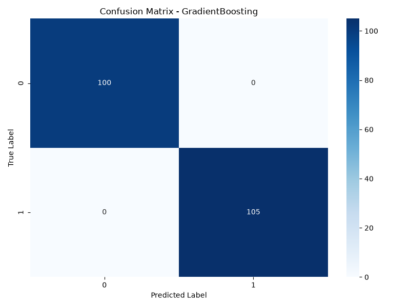
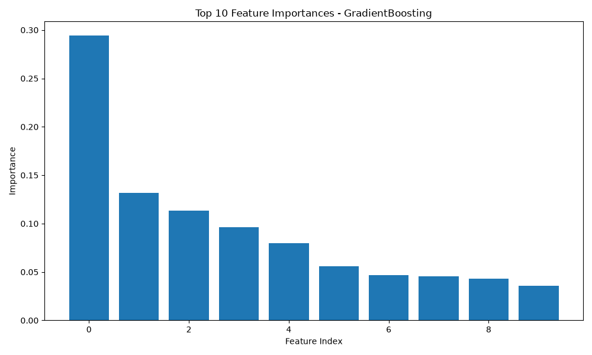
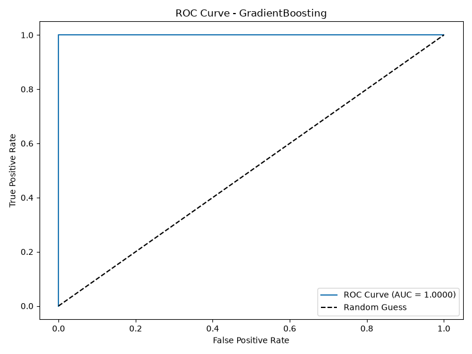

# Heart Disease Prediction — AutoML Pipeline

Автоматизированный ML-пайплайн для предсказания сердечно-сосудистых заболеваний
на основе медицинских показателей пациентов.

**Авторы:** Сидоров Павел, Сидорова Екатерина

---

## О проекте

**Бизнес-задача:** помочь врачам в ранней диагностике сердечно-сосудистых
заболеваний за счёт автоматического подбора оптимальной ML-модели.

**Датасет:** [Heart Disease Dataset](https://www.kaggle.com/datasets/johnsmith88/heart-disease-dataset)
(Kaggle) — 1025 записей, 13 признаков + целевая переменная.

**Целевая переменная:** `target` (0 — нет заболевания, 1 — есть заболевание).

**Тип задачи:** бинарная классификация.

---

## Схема пайплайна

```
Данные (CSV) → Предобработка → AutoML (GridSearchCV) → Оценка → Сохранение артефактов
```

1. **Extract** — загрузка `data/heart.csv`
2. **Transform** — обработка пропусков, `StandardScaler`, стратифицированное разделение 80/20
3. **AutoML** — обучение 4 моделей с подбором гиперпараметров (GridSearchCV, StratifiedKFold 5 фолдов)
4. **Evaluate** — Accuracy, Precision, Recall, F1, ROC-AUC + кросс-валидация
5. **Load** — сохранение модели, скалера, графиков, метрик

---

## Использованные модели

| Модель | Подбираемые гиперпараметры |
|--------|----------------------------|
| RandomForest | `n_estimators`, `max_depth`, `min_samples_split`, `min_samples_leaf` |
| GradientBoosting | `n_estimators`, `learning_rate`, `max_depth` |
| LogisticRegression | `C`, `penalty`, `solver` |
| SVM | `C`, `kernel`, `gamma` |

**Выбор лучшей модели** — автоматический, по кросс-валидационному score.

---

## Метрики качества

### Финальная модель: GradientBoostingClassifier

**Test set (205 записей, 20%)**

| Метрика | Значение |
|---------|----------|
| Accuracy | 1.00 |
| Precision | 1.00 |
| Recall | 1.00 |
| F1-Score | 1.00 |
| ROC-AUC | 1.00 |

**Кросс-валидация (StratifiedKFold, 5 фолдов)**

| Метрика | Значение |
|---------|----------|
| CV Accuracy (mean) | **0.9878** |
| CV Accuracy (std) | 0.0086 |

### Почему метрики такие высокие

Датасет Heart Disease (1025 записей, Kaggle) — синтетически расширенная
версия оригинального UCI-датасета (270 записей). Классы в нём хорошо
разделимы: признаки `cp`, `thalach`, `oldpeak`, `ca`, `thal` дают сильную
предсказательную силу. Baseline-модели на этом датасете регулярно
достигают 0.95+.

На **одном фиксированном тесте** (205 записей) возможны «идеальные»
результаты из-за малого размера выборки. **Кросс-валидация** даёт более
честную оценку — **0.98 ± 0.01**, что подтверждает корректность пайплайна
и отсутствие утечек данных.

### Сравнение моделей

| Модель | Accuracy | Precision | Recall | F1-Score |
|--------|----------|-----------|--------|----------|
| RandomForest | 1.00 | 1.00 | 1.00 | 1.00 |
| **GradientBoosting** | **1.00** | **1.00** | **1.00** | **1.00** |
| SVM | 0.985 | 0.972 | 1.000 | 0.986 |
| LogisticRegression | 0.810 | 0.762 | 0.914 | 0.831 |

### Визуализации





---

## Установка

### Способ 1: Poetry (рекомендуется)

```bash
git clone https://github.com/EkaZhuk/heart-disease-ml-pipeline.git
cd heart-disease-ml-pipeline
poetry install --with dev
```

### Способ 2: pip + venv

```bash
git clone https://github.com/EkaZhuk/heart-disease-ml-pipeline.git
cd heart-disease-ml-pipeline
python -m venv venv
source venv/Scripts/activate  # Windows (Git Bash)
pip install -e ".[dev]"
```

---

## Запуск

### Полный пайплайн

```bash
python -m src.automl_pipeline
```

> **Важно:** запускать именно через `-m` из **корня проекта**, чтобы импорты
> `from src.config import config` работали корректно.

**Что произойдёт:**
- загрузка и предобработка данных
- обучение 4 моделей с GridSearchCV
- оценка лучшей модели + кросс-валидация
- сохранение артефактов:
  - `models/heart_disease_model.pkl` — лучшая модель
  - `models/scaler.pkl` — StandardScaler
  - `plots/*.png` — confusion matrix, feature importance, ROC curve
  - `results/model_comparison.csv` — метрики всех моделей

### Тесты

```bash
pytest tests/ -v
```

### Линтеры и форматирование

```bash
pre-commit run --all-files
```

Проверяет:
- `ruff` — линтер (pycodestyle, pyflakes, isort, bugbear, print, ...)
- `ruff-format` — форматтер (замена black)
- `mypy` — статическая типизация
- `trailing-whitespace`, `end-of-file-fixer`, `check-yaml`, `check-toml`

---

## Конфигурация

Все параметры вынесены в `src/config.py` (Pydantic Settings).

**Значения по умолчанию:**

```python
data_path = Path("data/heart.csv")
models_dir = Path("models")
plots_dir = Path("plots")
results_dir = Path("results")
target_column = "target"
test_size = 0.2
random_state = 42
cv_folds = 5
```

**Переопределение через переменные окружения** (префикс `HD_`):

```bash
HD_RANDOM_STATE=123 HD_TEST_SIZE=0.3 python -m src.automl_pipeline
```

---

## Docker

### Сборка

```bash
docker build -t heart-disease-predictor .
```

### Запуск

```bash
docker run --rm -v "$(pwd)/data:/app/data" heart-disease-predictor
```

> **Важно:** датасет `heart.csv` не включён в образ (в `.gitignore`).
> Монтируйте папку `data/` через `-v`, иначе пайплайн упадёт с
> `FileNotFoundError`.

---

## CI/CD (GitHub Actions)

Workflow `.github/workflows/ci-cd.yml` запускается на push и pull request
в `main`:

1. **test** — установка зависимостей, прогон тестов, запуск пайплайна,
   загрузка модели как artifact
2. **build-docker** — сборка образа, тестовый запуск контейнера

---

## Структура проекта

```
heart-disease-ml-pipeline/
├── .github/
│   └── workflows/
│       └── ci-cd.yml             # CI/CD pipeline
├── configs/                       # (опционально) YAML-конфиги
├── data/
│   └── heart.csv                 # датасет (не коммитится)
├── models/                        # артефакты моделей (не коммитятся)
├── plots/                         # графики
├── results/                       # метрики
├── src/
│   ├── __init__.py
│   ├── automl_pipeline.py        # основной AutoML пайплайн
│   ├── config.py                 # Pydantic-конфиг
│   ├── data_preprocessing.py     # ETL
│   └── logger.py                 # единый логгер
├── tests/
│   ├── __init__.py
│   ├── test_automl.py
│   └── test_data_preprocessing.py
├── .gitignore
├── .pre-commit-config.yaml       # pre-commit хуки
├── Dockerfile
├── poetry.lock                   # lock-файл зависимостей
├── pyproject.toml                # конфиг Poetry + ruff + mypy
└── README.md
```

---

## Стек технологий

| Компонент | Технология |
|-----------|-----------|
| ML | scikit-learn, pandas, numpy |
| Визуализация | matplotlib, seaborn |
| Конфигурация | pydantic-settings |
| Управление зависимостями | Poetry |
| Линтеры | ruff, mypy |
| Pre-commit | pre-commit |
| Тесты | pytest |
| CI/CD | GitHub Actions |
| Контейнеризация | Docker |

---

## Лицензия

Учебный проект. Свободное использование в образовательных целях.
